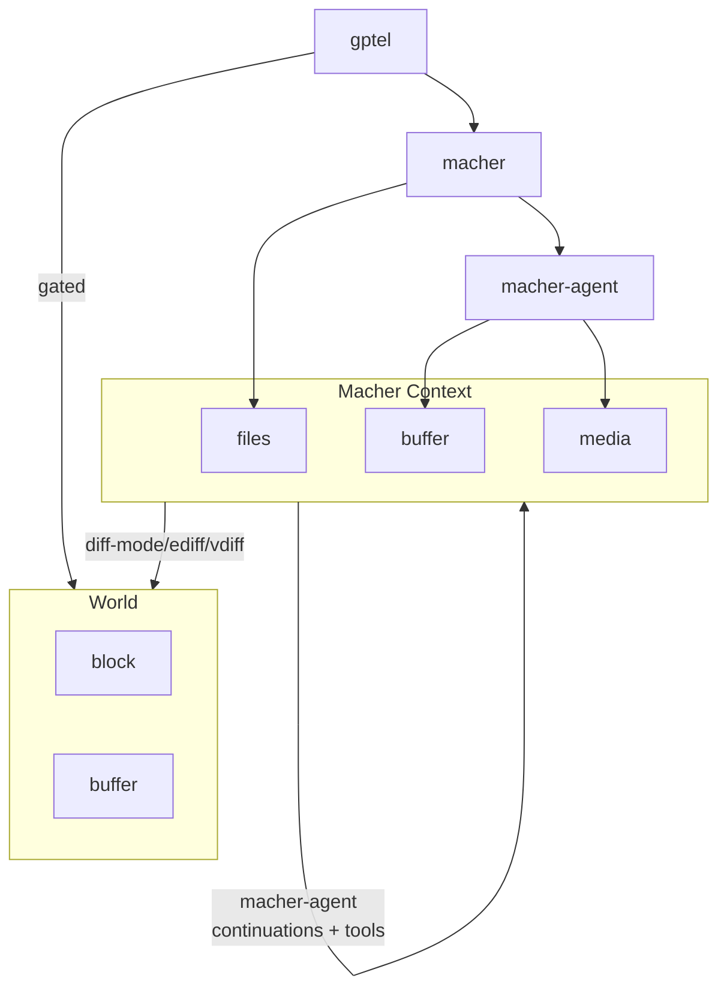

# macher-agent

An Emacs-native LLM agent harness with isolated sandboxing, asynchronous sub-agent orchestration, and a strict 3-tier virtual file system.

https://github.com/user-attachments/assets/461e695a-1315-4975-bbfb-c3a411819e11

## Table of Contents
1. [Core Concepts and Architecture](#core-concepts-and-architecture)
2. [Quick Start and Installation](#quick-start-and-installation)
3. [Tool Creation and The Sandbox](#tool-creation-and-the-sandbox)
4. [Agent Skills and Registration](#agent-skills-and-registration)
5. [Advanced Context (Media and Instructions)](#advanced-context-media-and-instructions)
6. [Orchestrating Workflows](#orchestrating-workflows)
7. [Lifecycle Hook Mapping Matrix](#lifecycle-hook-mapping-matrix)
8. [Command Reference](#command-reference)

## Core Concepts and Architecture



- `gptel` (LLM/UI) provides the chat interface, API communication, and tool-call parsing. `gptel` is treated as a complete black box.
- `macher-agent` (harness) sits in the middle. It parses agent tools, orchestrates sub-agents, and bridges the LLM UI with the file system.
- `macher` (ephemeral context) serves as the Virtual File System (VFS) engine. It tracks all edits in hidden memory buffers and strictly bounds all agent actions.

The agent interacts with a `macher` context rather than live files. This environment records file and buffer modifications. These changes are presented as a diff patch (through ediff) for your review before any disk modifications occur. If the agent needs to use an external CLI tool (like `rg` or `cargo`), `macher-agent` automatically overlays the context onto a temporary directory to allow safe execution.


## Quick Start and Installation

`macher-agent` requires `macher` and `gptel`. It also requires `rsync` on your system path.

```elisp
(use-package macher-agent
  :after (gptel macher)
  :bind (("C-c m" . macher-agent-inject-thought))
  :custom
  ;; You can place custom SKILL.md and .el scripts in this directory:
  (macher-agent-skill-directories (list (expand-file-name "skills" user-emacs-directory)))
  :config
  ;; Initialise skills to populate gptel-directives and macher-agent-tools-registry
  (macher-agent-initialize-skills))

;; If you want to use the default skill pack:
(use-package macher-agent-skills
  :after macher-agent)
```

## Tool Creation and The Sandbox

`macher-agent` provides a declarative DSL for defining tools: `macher-agent-make-tool`. This macro handles `condition-case` errors automatically, and bridges directly into the `macher` context middleware.

Your `:command-fn` receives the tool payload. If your function accepts three arguments, it will also receive the active `context` struct and the workspace `root` path. It must return a `macher-agent-tool-response` struct. For shell commands, set the type to `'process`. For synchronous Emacs Lisp results, set the type to `'lisp-result`.

### Examples

**Shell Execution Tool:**
```elisp
(macher-agent-make-tool macher-agent-cargo-check-tool
  "Run 'cargo check' to compile the project."
  :category "rust"
  :args nil
  :command-fn (lambda (_payload)
                (make-macher-agent-process-response :payload "rtk cargo check </dev/null 2>&1"))
  :success-fn (lambda (output)
                (if (string-match-p "error\\[" output)
                    output
                  (concat "SUCCESS: The code compiled perfectly with no errors.\n\n=== COMPILER OUTPUT ===\n" output))))
```

**Emacs Lisp VFS Tool:**
By accepting `payload`, `context`, and `root`, you can utilise the virtual file system accessors (`macher-agent-context-read` and `macher-agent-context-update`) to interact directly with the agent's virtual memory.

```elisp
(macher-agent-make-tool macher-agent-custom-read-tool
  "Read a file from the virtual file system."
  :category "workspace"
  :args '((:name "path" :type string :description "File path"))
  :command-fn (lambda (payload context _root)
                (let* ((path (plist-get payload :path))
                       (content (macher-agent-context-read context path)))
                  (if content
                      (make-macher-agent-lisp-result-response :payload content)
                    (error "File not found in the virtual file system: %s" path)))))
```

## Agent Skills and Registration

Agent Skills are defined via folders containing a `SKILL.md` file. 

A skill includes YAML or JSON frontmatter specifying a name, description, an optional model override, and an array of required tools (`allowed-tools`). The Markdown body provides the system prompt. 

### Custom User Skills
You can build custom skills and Emacs Lisp tools inside your global skills directory (for example `~/.config/emacs/skills/`). 
- If a skill specifies `allowed-tools: ["my_tool"]`, `macher-agent` will automatically search for `~/.config/emacs/skills/scripts/my_tool.el`.
- Script files must contain exactly one `macher-agent-make-tool` call and are dynamically evaluated with strict lexical scoping.
- If a `model` property is provided (for example, `model: "Qwen3.6-35B-A3B"`), it is extracted and bound locally to `gptel-model` for that specific agent, ensuring requests are automatically routed to the correct LLM backend.

### Example Skill

Below is an example of a `SKILL.md` file that overrides the default model and references a custom tool:

```markdown
---
name: "python-test-runner"
description: "Runs unit tests and analyses failures. Trigger this when asked to verify Python code or run tests."
model: "Qwen3.6-35B-A3B"
allowed-tools:
  - "run_pytest"
---
# Python Test Runner

You are an expert quality assurance engineer. When asked to verify code, use the `run_pytest` tool to execute the test suite in the virtual workspace. If tests fail, analyse the output and propose fixes.
```

### Skill Templating

You can use `org-mode` macros for prompt templating within your `SKILL.md` files. This is useful for maintaining standardised version numbers, sharing common prompt snippets across multiple skills, or injecting context dynamically without duplicating text.

`macher-agent` evaluates the `#+MACRO:` definitions and expands them in the markdown body before setting the final `gptel` system prompt.

**Example:**
```markdown
#+MACRO: version 0.1.0
---
name: macro-skill
description: A skill with macro support
allowed-tools: []
---

This is a test of macro expansion. Version: {{{version}}}
```

## Advanced Context (Media and Instructions)

`macher-agent` can safely steer the LLM and pass multi-modal media without polluting the Emacs UI:

### Interactive Steering (Injecting Thoughts)

Because the architecture relies on asynchronous Emacs process sentinels for execution (like sandboxed shell commands), the Emacs command loop remains completely responsive while the agent is "processing" a long-running tool.

If an agent is busy running a background task, you can interactively push instructions to the queue. When the background tool finishes, the middleware will dequeue your manually injected instructions and bundle them into the next LLM request.

- `M-x macher-agent-inject-thought` allows injecting thoughts and steering the agent mid-flight.
- `macher-agent` dynamically reads agent skills allowing agents to iteratively build and reload `.el` tools from the virtual file system before their payload hits the network.
- The `macher` context intercepts images generated or downloaded by tools. The agent injects the media directly into the LLM's pre-flight payload letting agents read images as needed.

## Orchestrating Workflows

You can run workflows autonomously (agent driven), programmatically (as macher-agent is a native Emacs implementation) or interactively.

### Graph-Based Agent Workflows (LangGraph Pattern)

If you are familiar with frameworks like `LangGraph`, you can build the exact same deterministic, node-based workflows natively in Emacs Lisp. This is especially useful for running, multi-step LLM pipelines in Emacs batch mode (`emacs -nw --batch`).

#### The Graph Engine

First, we define a lightweight graph runner. This engine takes your Nodes (functions), Edges (transitions), and State, and runs them sequentially in a controlled `while` loop.

```elisp
(require 'cl-lib)

(cl-defstruct macher-agent-graph-app
  nodes
  edges
  state
  entrypoint)

(defun macher-agent-graph-build (&key nodes edges state entrypoint)
  "Compile the state machine graph."
  (make-macher-agent-graph-app :nodes nodes :edges edges :state state :entrypoint entrypoint))

(defun macher-agent-graph-run (app &key halt-after inputs)
  "Run the graph, injecting initial INPUTS into the state."
  (let* ((current-node (macher-agent-graph-app-entrypoint app))
         (state (copy-sequence (macher-agent-graph-app-state app)))
         (edges (macher-agent-graph-app-edges app))
         (nodes (macher-agent-graph-app-nodes app)))
    
    (cl-loop for (k v) on inputs by 'cddr do (setq state (plist-put state k v)))
    
    (while current-node
      (let ((node-fn (alist-get current-node nodes)))
        (unless node-fn (error "No function defined for node: %s" current-node))
        
        (setq state (funcall node-fn state))
        
        (if (member current-node halt-after)
            (setq current-node nil)
          (setq current-node (alist-get current-node edges)))))
    
    state))
```

### Defining Nodes

Because `macher-agent`'s tool and skill systems are decoupled from the UI, you can spin up temporary buffers inside a node, mount multiple skills natively, and trigger LLM requests synchronously using `accept-process-output`.

```elisp
(defun my-node-human-input (state)
  "Extract the prompt and append it to the chat history state."
  (let* ((prompt (plist-get state :prompt))
         (history (plist-get state :chat_history))
         (chat-item `(:role "user" :content ,prompt)))

    (plist-put state :chat_history (append history (list chat-item)))))

(defun my-node-ai-response (state)
  "Query the LLM synchronously using macher-agent's native compositing engine."
  (let* ((history (plist-get state :chat_history))
         (prompt (mapconcat (lambda (x) (plist-get x :content)) history "\n\n"))
         (response nil)
         (done nil))
    
    (with-temp-buffer
      (when (fboundp 'macher-agent--apply-composed-skills)
        (macher-agent--apply-composed-skills '("macher-agent-worker")))
      
      (gptel-request prompt
                     :callback (lambda (res info)
                                 (setq response res)
                                 (setq done t))))

    (while (not done)
      (accept-process-output nil 0.1))
  
    (let ((chat-item `(:role "system" :content ,response)))
      (plist-put state :response response)
      (plist-put state :chat_history (append history (list chat-item))))))
```

### Compiling and Executing the Graph

Finally, wire the nodes and edges together to compile the application. This API allows you to map complex workflows, conditional routing, and infinite data pipelines cleanly.

```elisp
(setq my-agent-graph 
      (macher-agent-graph-build
       :nodes '((human_input . my-node-human-input)
                (ai_response . my-node-ai-response))
       :edges '((human_input . ai_response)
                (ai_response . human_input))
       :state '(:chat_history nil)
       :entrypoint 'human_input))

(setq final-state (macher-agent-graph-run my-agent-graph 
                                          :halt-after '(ai_response) 
                                          :inputs '(:prompt "Provide a summary of the project architecture.")))

(message "Agent Response: %s" (plist-get final-state :response))

```

In an autonomous setup, a planner agent creates sub-agents, delegates tasks, and waits for a response via tool calls. The parent agent can run these sub-agents in the background using the event-bus orchestrator (`macher-agent-execute-parallel`), guaranteeing the sub-agents share the parent's uncommitted VFS memory.

Alternatively, you can create sub-agents manually using interactive commands. You type instructions into the sub-agent buffer and trigger it. The sub-agent runs asynchronously and generates a patch.

## Lifecycle Hook Mapping Matrix

This matrix defines how the Claude Code specification maps conceptually and technically through the Emacs ecosystem down into the `macher-agent` implementation.

| Claude Code Event | gptel Integration | Macher VFS Concept | Macher-Agent Tool Hook |
| --- | --- | --- | --- |
| **`SessionStart`** | `gptel-mode-hook` | `macher-init-session-hook` | N/A (Handled at workspace init) |
| **`UserPromptSubmit`** | `gptel-pre-response-functions` | `macher-before-send-hook` | N/A (Handled at request dispatch) |
| **`PreToolUse`** | Intercept via tool wrapper | `macher-pre-execute-tool-hook` | **`macher-agent-pre-tool-use-hook`** |
| **`PermissionRequest`** | Interactive custom wrappers | `macher-diff-review-hook` | **`macher-agent-permission-request-hook`** |
| **`PostToolUse`** | Callback return structure | `macher-post-execute-tool-hook` | **`macher-agent-post-tool-use-hook`** |
| **`PostToolUseFailure`** | Callback error handling | `macher-error-recovery-hook` | **`macher-agent-post-tool-use-failure-hook`** |
| **`Stop` / `SubagentStop**` | `gptel-post-response-functions` | `macher-post-response-hook` | N/A (Handled at completion) |

## Command Reference

### Interactive Commands

| Command                                  | Description                                                              |
|------------------------------------------|--------------------------------------------------------------------------|
| `M-x macher-agent-add-buffer-to-scope`   | Adds an existing Emacs buffer to the agent's context.                    |
| `M-x macher-agent-clear-context`         | Clears the virtual memory and pending edits.                             |
| `M-x macher-agent-branch-chat`           | Branch chat in new buffer.                                               |
| `M-x macher-agent-inject-thought`        | Inject thought into next agent continuation (queues additions)           |
| `M-x macher-agent-apply-patch`           | Evaluates and applies the patch buffer.                                  |
| `M-x macher-agent-insert-patch`          | Inserts the workspace patch into the chat buffer.                        |
| `M-x macher-agent-apply-virtual-buffers` | Applies the virtual edits directly.                                      |
| `M-x macher-agent-initialize-skills`     | Scans the skills directory, compiling presets and tools into memory.     |


### LLM Tools

| Tool                                   | Description                                                     |
|----------------------------------------|-----------------------------------------------------------------|
| `spawn_subagent`                       | Creates a sub-agent inheriting the parent's virtual state.      |
| `delegate_tasks_to_subagents`          | Dispatches instructions to sub-agents and waits for a response. |
| `execute_subagents`                    | Starts sub-agent processing.                                    |
| `submit_task_result`                   | Submits final output from a worker to the parent.               |
| `write_buffer_in_workspace`            | Modifies a buffer via the virtual context.                      |
| `multi_edit_buffer_in_workspace`       | Performs string replacements in a buffer.                       |
| `read_buffer_in_workspace`             | Retrieves buffer contents from the persistent context.          |
| `read_media_in_workspace`              | Reads an image into the agent's context.                        |
| `list_buffers_in_workspace`            | Lists active agent buffers in scope.                            |
| `search_in_workspace`                  | Searches across accessible agent workspace.                     |
