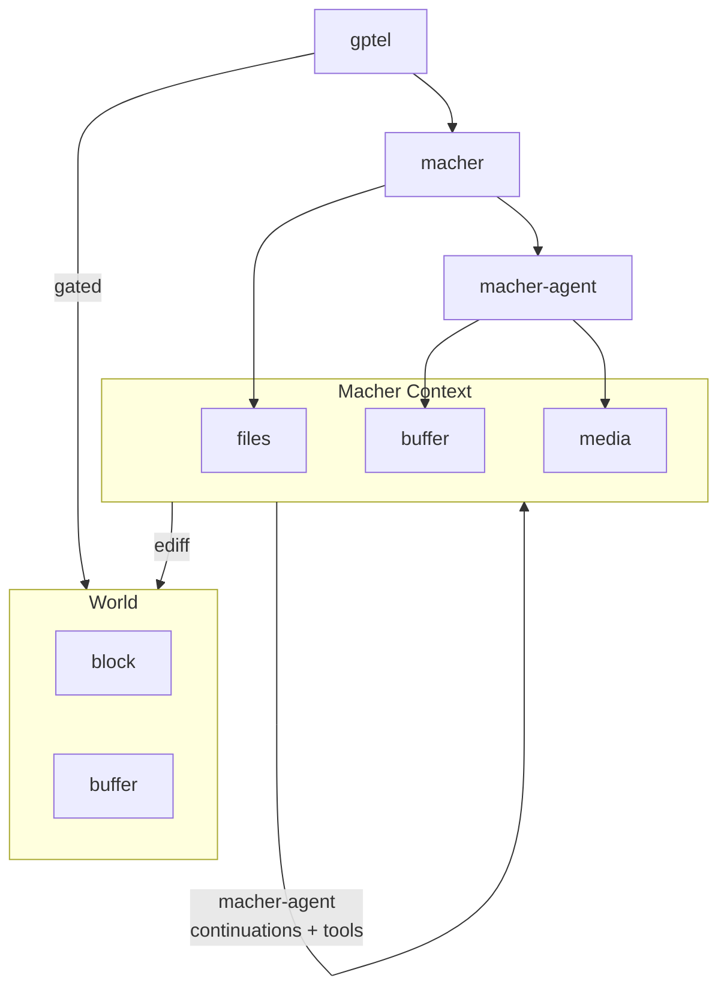

# macher-agent

An Emacs-native LLM agent harness with isolated sandboxing, asynchronous sub-agent orchestration, and virtual file merging.

https://github.com/user-attachments/assets/461e695a-1315-4975-bbfb-c3a411819e11

## Table of Contents
1. [Core Concepts](#core-concepts)
2. [Quick Start and Installation](#quick-start-and-installation)
3. [Architecture](#architecture)
4. [Tool Creation](#tool-creation)
5. [Agent Skills](#agent-skills)
6. [Orchestrating Workflows](#orchestrating-workflows)
7. [Command Reference](#command-reference)

## Core Concepts

The agent interacts with a virtual memory sandbox, called the `macher` context, rather than live files. This environment records file and buffer modifications. These changes are presented as a diff patch for your review before any disk modifications occur.

The framework supports multi-agent execution. A planner agent can create sub-agent buffers. These sub-agents inherit their parent's virtual state, execute tasks, and report back via tool calls. This asynchronous model keeps Emacs responsive.

The agent is also capable of reading media from the virtual context. If the `gptel-track-media` option is enabled, agents can dynamically read newly generated or updated images (for example, charts generated by a tool) back into their visual context to analyse them on subsequent turns.

The context tree shows the agent's current state. It tracks intermediate edits and checks if the context is still valid across conversational turns.


## Quick Start and Installation

`macher-agent` requires `macher` and `gptel`. It also requires `rsync` on your system path.

```elisp
(use-package macher-agent
  :after (gptel macher)
  :config
  ;; Configuration
  )
```

## Architecture



## Tool Creation

`macher-agent` provides context-aware tools. Whilst `gptel-make-tool` is useful for pure OS wide operations, `macher-agent-make-tool` provides access to the virtual file and buffer state. This ensures commands operate on the agent's sandbox rather than your live workspace.

Here is an example demonstrating a tool that checks the syntax of a Python file within the virtual environment.

```elisp
(add-to-list 'gptel-tools
             (macher-agent-make-tool
              :name "check_python_syntax"
              :description "Checks Python file syntax using py_compile."
              :args (list '(:name "file_path" :type string :description "Python file to check"))
              :command-fn (lambda (args)
                            (format "python -m py_compile %s" 
                                    (shell-quote-argument (plist-get args :file_path))))))
```

For more complex tasks, use output filters and success functions. This helps route compilation or linting commands through the virtual workspace and returns parsed results to the agent.

```elisp
(add-to-list 'gptel-tools
             (macher-agent-make-tool
              :name "cargo_check"
              :description "Run 'cargo check' to compile the project."
              :args nil
              :command-fn (lambda (_) "rtk cargo check </dev/null 2>&1")
              :success-fn (lambda (_) "SUCCESS: The code compiled.")
              :output-filter (lambda (raw-output)
                               (if (string-prefix-p "Execution failed" raw-output)
                                   raw-output
                                 (concat "Fix the following errors.\n\n" raw-output)))))
```

## Agent Skills

Agent Skills are defined via folders containing a `SKILL.md` file. This format is similar to typical agent skills. 

A skill includes YAML or JSON frontmatter specifying a name, description, and an array of required tools (`allowed-tools`). The Markdown body provides the system prompt. 

### Isomorphisms and Differences

Like agent skills, `macher-agent` uses the `SKILL.md` description as the primary mechanism for triggering the skill. Both systems use progressive disclosure, keeping the body in context when the skill is active.

However, there are differences:
- In `macher-agent`, a `SKILL.md` file can specify the model directly in the frontmatter (`model: "qwen3.6-35b-a3b-gguf"`). The agent will use this model instead of your Emacs default.
- Agemt skills bundle executable scripts (`.py`, `.sh`) in a `scripts/` directory. `macher-agent` instead relies on Emacs Lisp tools defined via `gptel-make-tool` or `macher-agent-make-tool`. If a skill requests a tool, `macher-agent` expects an equivalent `.el` script in its `/scripts/` directory, which is evaluated and injected into the session.
- Agent skills expect to operate directly on the user's filesystem. `macher-agent` skills must use virtual file and buffer access tools to interact with the sandboxed context.

### Example Skill and Support Script

Below is an example of a `SKILL.md` file that overrides the default model and references a custom testing tool:

```markdown
---
name: "python-test-runner"
description: "Runs unit tests and analyses failures. Trigger this when asked to verify Python code or run tests."
model: "qwen3.6-35b-a3b-gguf"
allowed-tools:
  - "run_pytest"
---
# Python Test Runner

You are an expert quality assurance engineer. When asked to verify code, use the `run_pytest` tool to execute the test suite in the virtual workspace. If tests fail, analyse the output and propose fixes.
```

This skill requires the `run_pytest` tool. The corresponding Emacs Lisp support script, which should be placed in `scripts/run_pytest.el` within the skill directory, looks like this:

```elisp
(add-to-list 'gptel-tools
             (macher-agent-make-tool
              :name "run_pytest"
              :description "Runs pytest on a specific test file within the virtual workspace."
              :args (list '(:name "test_file" :type string :description "Path to the test file"))
              :command-fn (lambda (args)
                            (format "pytest %s" (shell-quote-argument (plist-get args :test_file))))
              :success-fn (lambda (_) "SUCCESS: All tests passed.")
              :output-filter (lambda (raw-output)
                               (if (string-match-p "failed" raw-output)
                                   (concat "Test failures detected:\n" raw-output)
                                 raw-output))))
```

You can set a global repository using `macher-agent-global-skills-directory`. Local workspace skills can be loaded interactively, but they cannot execute arbitrary `.el` scripts and must rely on globally registered tools.

## Orchestrating Workflows

You can run workflows autonomously or manually.

In an autonomous setup, a planner agent creates sub-agents, delegates tasks, and waits for a response via tool calls. The parent agent can run these sub-agents in the background.

Alternatively, you can create sub-agents manually using interactive commands. You type instructions into the sub-agent buffer and trigger it. The sub-agent runs asynchronously and generates a patch.

## Command Reference

### Interactive Commands

| Command                                  | Description                                                              |
|------------------------------------------|--------------------------------------------------------------------------|
| `M-x macher-agent-add-subagent`          | Prompts for a name and directory, creating an isolated sub-agent buffer. |
| `M-x macher-agent-add-buffer-to-scope`   | Adds an existing Emacs buffer to the agent's context.                    |
| `M-x macher-agent-clear-context`         | Clears the virtual memory and pending edits.                             |
| `M-x macher-agent-apply-patch`           | Evaluates and applies the patch buffer.                                  |
| `M-x macher-agent-insert-patch`          | Inserts the workspace patch into the chat buffer.                        |
| `M-x macher-agent-apply-virtual-buffers` | Applies the virtual edits directly.                                      |
| `M-x macher-agent-load-workspace-skills` | Scans the workspace for SKILL.md files and loads them.                   |

### LLM Tools

| Tool                                   | Description                                                     |
|----------------------------------------|-----------------------------------------------------------------|
| `spawn_subagent`                       | Creates a sub-agent inheriting the parent's virtual state.      |
| `delegate_task_to_subagents`           | Dispatches instructions to sub-agents and waits for a response. |
| `execute_subagents`                    | Starts sub-agent processing.                                    |
| `submit_task_result`                   | Submits final output from a worker to the parent.               |
| `write_buffer_in_workspace`            | Modifies a buffer via the virtual context.                      |
| `write_and_commit_buffer_in_workspace` | Overwrites a buffer and syncs the context.                      |
| `multi_edit_buffer_in_workspace`       | Performs string replacements in a buffer.                       |
| `read_buffer_in_workspace`             | Retrieves buffer contents from the persistent context.          |
| `read_media_in_workspace`              | Reads an image into the agent's context. |
| `list_buffers_in_workspace`            | Lists active agent buffers in scope.                            |
| `search_buffers_in_workspace`          | Searches across accessible agent buffers.                       |
