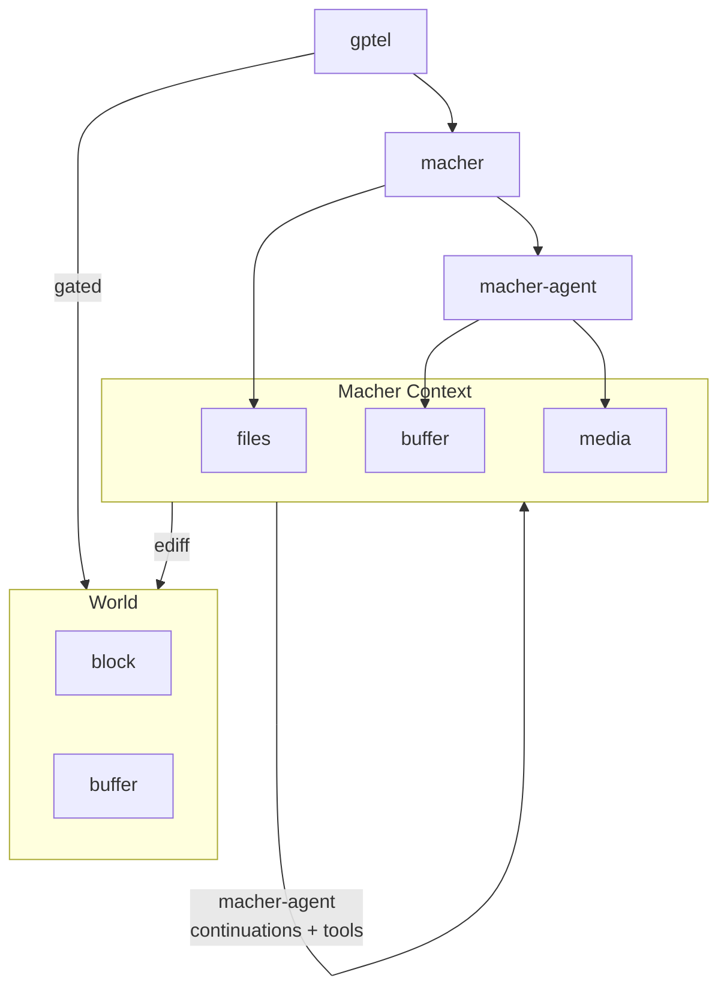

# macher-agent

An Emacs-native LLM agent harness with isolated sandboxing, asynchronous sub-agent orchestration, and a strict 3-tier virtual file system.

https://github.com/user-attachments/assets/461e695a-1315-4975-bbfb-c3a411819e11

## Table of Contents
1. [Core Concepts and Architecture](#core-concepts--architecture)
2. [Quick Start and Installation](#quick-start-and-installation)
3. [Tool Creation and The Sandbox](#tool-creation--the-sandbox)
4. [Agent Skills and Registration](#agent-skills--registration)
5. [Advanced Context (Media and Instructions)](#advanced-context-media--instructions)
6. [Orchestrating Workflows](#orchestrating-workflows)
7. [Command Reference](#command-reference)

## Core Concepts and Architecture



- `gptel` (LLM/UI) provides the chat interface, API communication, and tool-call parsing. `gptel` is treated as a complete black box.
- `macher-agent` (harness) sits in the middle. It safely parses agent tools, orchestrates sub-agents, and bridges the LLM UI with the file system.
- `macher` (ephemeral context) serves as the Virtual File System (VFS) engine. It tracks all edits in hidden memory buffers and strictly bounds all agent actions.

The agent interacts with a `macher` context rather than live files. This environment records file and buffer modifications. These changes are presented as a diff patch (through ediff) for your review before any disk modifications occur. If the agent needs to use an external CLI tool (like `rg` or `cargo`), `macher-agent` automatically overlays the context onto a temporary directory to allow safe execution.


## Quick Start and Installation

`macher-agent` requires `macher` and `gptel`. It also requires `rsync` on your system path.

```elisp
(use-package macher-agent
  :after (gptel macher)
  :custom
  ;; You can place custom SKILL.md and .el scripts in this directory:
  (macher-agent-global-skills-directory (expand-file-name "skills" user-emacs-directory))
  :config
  ;; Initialise skills to populate gptel-directives and macher-agent-tools-registry
  (macher-agent-initialize-skills))

;; If you want to use the default skill pack:
(use-package macher-agent-skills
  :after macher-agent)
```

## Tool Creation and The Sandbox

`macher-agent` provides a DSL for defining tools: `macher-agent-make-tool`. This macro mirrors `gptel-make-tool` but adds automatic async execution, error handling, and hooks into the `macher` context.

Here is an example demonstrating a tool that executes a shell command safely across the workspace. It uses the `:sandbox t` flag to execute the command inside a temporary, virtual overlay director. The framework handles building and cleaning up the sandbox, and exposes a `sandbox-dir` local variable to your handler.

```elisp
(macher-agent-make-tool macher-agent-cargo-check-tool
  ("Run 'cargo check' to compile the project."
   "rust"
   :async t
   :sandbox t)
  ()
  (macher-agent--run-async-cmd
   "cargo-check" "rtk cargo check </dev/null 2>&1" sandbox-dir
   (lambda (exit-code output)
     (if (= exit-code 0)
         (funcall gptel-callback (concat "SUCCESS: The code compiled perfectly with no errors.\n" output))
       (funcall gptel-callback output)))))
```

## Agent Skills and Registration

Agent Skills are defined via folders containing a `SKILL.md` file. 

A skill includes YAML or JSON frontmatter specifying a name, description, and an array of required tools (`allowed-tools`). The Markdown body provides the system prompt. 

### Custom User Skills
You can build custom skills and Emacs Lisp tools inside your global skills directory (for example`~/.config/emacs/skills/`). 
* If a skill specifies `allowed-tools: ["my_tool"]`, `macher-agent` will automatically search for `~/.config/emacs/skills/scripts/my_tool.el`.
* All custom `.el` tools *must* use the `macher-agent-make-tool` macro (not the standard `gptel-make-tool`) to ensure they are properly registered into the `macher-agent-tools-registry`.

### Example Skill

Below is an example of a `SKILL.md` file that overrides the default model and references a custom tool:

```markdown
---
name: "python-test-runner"
description: "Runs unit tests and analyses failures. Trigger this when asked to verify Python code or run tests."
model: "qwen3.6-35b-a3b-gguf"
allowed-tools:
  - "run_pytest"
---
# Python Test Runner

You are an expert quality assurance engineer. When asked to verify code, use the `run_pytest` tool to execute the test suite in the virtual workspace. If tests fail, analyse the output and propose fixes.
```

## Advanced Context (Media and Instructions)

`macher-agent` can safely steer the LLM and pass multi-modal media without polluting the Emacs UI:

1. If a tool or user needs to direct the agent's *next* thought (for example "Do not guess. Read the file."), it can call `(macher-agent-add-pending-instruction "...")` while executing. `macher-agent` will automatically append this as a `=== SYSTEM DIRECTIVE ===` block to the tool's output.
2. The `macher` context intercepts images generated or downloaded by tools. The agent injects the media directly into the LLM's pre-flight payload, completely bypassing `gptel`'s text-buffer limitations and letting agents read images as needed.

## Orchestrating Workflows

You can run workflows autonomously or manually.

In an autonomous setup, a planner agent creates sub-agents, delegates tasks, and waits for a response via tool calls. The parent agent can run these sub-agents in the background.

Alternatively, you can create sub-agents manually using interactive commands. You type instructions into the sub-agent buffer and trigger it. The sub-agent runs asynchronously and generates a patch.

## Command Reference

### Interactive Commands

| Command                                  | Description                                                              |
|------------------------------------------|--------------------------------------------------------------------------|
| `M-x macher-agent-add-subagent`          | Prompts for a name and directory, creating an isolated sub-agent buffer. |
| `M-x macher-agent-add-buffer-to-scope`   | Adds an existing Emacs buffer to the agent's context.                    |
| `M-x macher-agent-clear-context`         | Clears the virtual memory and pending edits.                             |
| `M-x macher-agent-apply-patch`           | Evaluates and applies the patch buffer.                                  |
| `M-x macher-agent-insert-patch`          | Inserts the workspace patch into the chat buffer.                        |
| `M-x macher-agent-apply-virtual-buffers` | Applies the virtual edits directly.                                      |
| `M-x macher-agent-load-workspace-skills` | Scans the workspace for SKILL.md files and loads them.                   |

### LLM Tools

| Tool                                   | Description                                                     |
|----------------------------------------|-----------------------------------------------------------------|
| `spawn_subagent`                       | Creates a sub-agent inheriting the parent's virtual state.      |
| `delegate_task_to_subagents`           | Dispatches instructions to sub-agents and waits for a response. |
| `execute_subagents`                    | Starts sub-agent processing.                                    |
| `submit_task_result`                   | Submits final output from a worker to the parent.               |
| `write_buffer_in_workspace`            | Modifies a buffer via the virtual context.                      |
| `write_and_commit_buffer_in_workspace` | Overwrites a buffer and syncs the context.                      |
| `multi_edit_buffer_in_workspace`       | Performs string replacements in a buffer.                       |
| `read_buffer_in_workspace`             | Retrieves buffer contents from the persistent context.          |
| `read_media_in_workspace`              | Reads an image into the agent's context. |
| `list_buffers_in_workspace`            | Lists active agent buffers in scope.                            |
| `search_in_workspace`                  | Searches across accessible agent workspace.                     |
